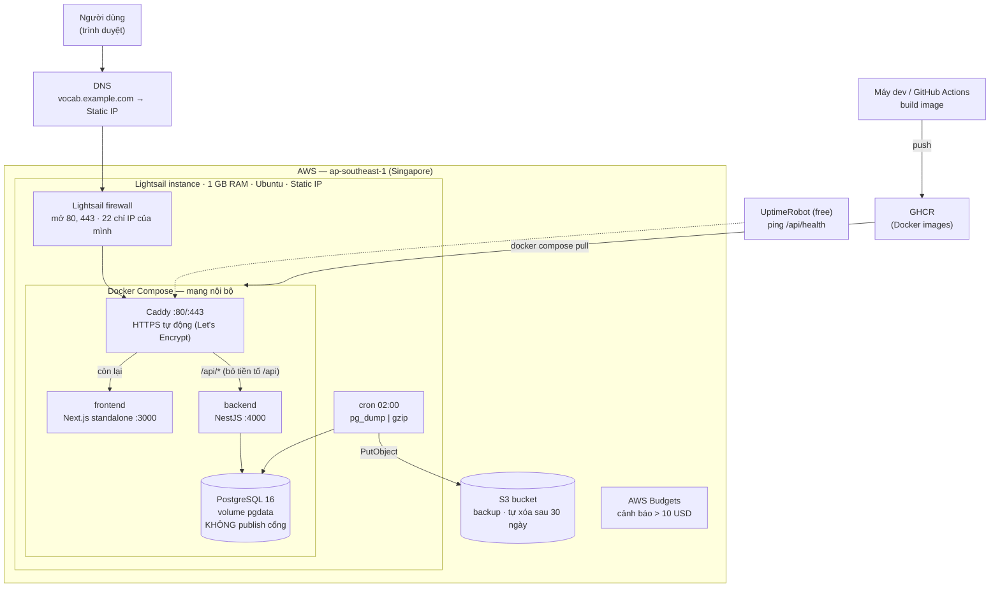

# AWS_PLAN.md — Kế hoạch kiến trúc AWS (Phase 13)

> **Trạng thái: ĐÃ CHỐT** ngày 2026-10-08 — [ADR-014](DECISIONS.md). Tiến độ từng task:
> nhóm F14 trong [PLAN.md](PLAN.md). Cách dựng: [infra/README.md](../infra/README.md) ·
> pipeline: [GIT_FLOW.md](GIT_FLOW.md).
>
> Giá trong file này là **ước tính theo trí nhớ**, vùng Singapore, chưa đối chiếu lại bảng
> giá AWS. Kiểm tra lại ở trang pricing trước khi tạo tài nguyên.

---

## 1. Đề bài

| Yêu cầu | Hệ quả thiết kế |
|---|---|
| App nhỏ, vài người dùng | Không cần auto-scaling, load balancer, multi-AZ |
| Dữ liệu chỉ là từ vựng + tiến độ học | Không cần VPC riêng, WAF, Secrets Manager. Vẫn cần HTTPS (mật khẩu đi qua mạng) và backup (mất tiến độ học là mất thứ duy nhất có giá trị) |
| Rẻ nhất có thể | Tránh mọi dịch vụ tính tiền "chỉ để tồn tại": ALB (~18 USD), NAT Gateway (~32 USD), RDS (~15 USD) |

## 2. Quyết định: một máy Lightsail chạy Docker Compose

Toàn bộ app — Next.js, NestJS, PostgreSQL — chạy trên **một máy ảo Lightsail**, đứng sau
Caddy làm reverse proxy và tự lo chứng chỉ HTTPS.

**Chi phí: khoảng 7–8 USD/tháng**, cố định, không tăng theo lượt dùng.

### Sơ đồ



Bản ASCII (cho nơi không render được Mermaid):

```
Trình duyệt ──HTTPS──► vocab.example.com (Static IP)
                              │
              ┌───────────────▼──────────────── Lightsail 1 GB ──┐
              │  Caddy :443  (Let's Encrypt)                     │
              │    ├─ /api/*  ──► backend  NestJS :4000 ──┐      │
              │    └─ /*      ──► frontend Next.js :3000  │      │
              │                                           ▼      │
              │                              PostgreSQL 16 (volume)
              │  cron ─ pg_dump ─────────────────────────────────┼──► S3 (backup 30 ngày)
              └──────────────────────────────────────────────────┘
   Image: máy dev / GitHub Actions ──► GHCR ──► docker compose pull
```

### Bảng chi phí

| Hạng mục | USD/tháng | Ghi chú |
|---|---|---|
| Lightsail 1 GB RAM, 2 vCPU, 40 GB SSD, có IPv4 | ~7 | Đã gồm static IP và ~2 TB băng thông |
| S3 backup (vài MB × 30 bản) | ~0,01 | |
| Tên miền | 0 – ~1 | Tùy chọn. Bắt đầu bằng DuckDNS miễn phí, mua sau |
| Let's Encrypt, GHCR, UptimeRobot, AWS Budgets | 0 | |
| **Tổng** | **~7–8** | |

Gói 512 MB (~5 USD) **không đủ**: Postgres + NestJS + Next.js cần khoảng 500–600 MB.
Gói 1 GB chạy được nếu bật thêm 1–2 GB swap.

## 3. Vì sao không chọn các phương án khác

| Phương án | USD/tháng | Vì sao loại |
|---|---|---|
| **Lightsail một máy** (chọn) | ~7 | — |
| A. S3+CloudFront, Fargate+ALB, RDS | ~45–60 | ALB và RDS tính tiền kể cả khi không ai dùng. Đắt gấp 7 lần cho cùng vài người dùng |
| C. S3+CloudFront, App Runner, RDS | ~17–30 | Vẫn phải trả RDS; nếu thay bằng Neon/Supabase thì database nằm ngoài AWS |
| EC2 t4g.micro tự dựng | ~11 | Cùng mô hình với Lightsail nhưng trả riêng EBS và IPv4 (~3,6 USD). Không được thêm gì |
| Lambda + database free tier ngoài AWS | ~0 | Rẻ nhất, nhưng: cold start, Prisma trên Lambda phải cấu hình riêng, bộ đếm rate-limit trong RAM mất tác dụng, database không thuộc AWS. Quá nhiều thứ mới cùng lúc cho lần deploy đầu |

**Cái giá của lựa chọn này** (chấp nhận có chủ đích):

- **Một điểm hỏng duy nhất.** Máy chết thì app chết. Với vài người dùng, vài chục phút
  downtime là chấp nhận được; mất dữ liệu thì không → backup ra S3 là bắt buộc.
- **Tự vá hệ điều hành và Postgres.** Bật `unattended-upgrades` cho Ubuntu.
- **Không học được** VPC, ECS, RDS, CloudFront. Đổi lại học Docker Compose, reverse proxy,
  HTTPS, backup/restore — nền tảng của mọi kiến trúc phía trên.

## 4. Ba điều chỉnh so với tài liệu hiện có

1. **Frontend không static export được.** [ARCHITECTURE.md §7](ARCHITECTURE.md) giả định
   "Next static export → S3", nhưng app có route động (`/collections/[id]`,
   `/languages/[id]`, `/vocabulary/[id]/edit`) với id chỉ biết lúc chạy. Static export đòi
   `generateStaticParams` liệt kê trước mọi id — không làm được. Vì vậy Next.js chạy dạng
   server (`output: 'standalone'`) ngay trên máy Lightsail.
2. **API đi qua tiền tố `/api` ở Caddy.** Backend không có global prefix, nên `/languages`
   và `/vocabulary` trùng tên với trang frontend. Caddy nhận `/api/*`, **bỏ tiền tố** rồi
   chuyển cho NestJS; frontend build với `NEXT_PUBLIC_API_URL=/api`. Backend không đổi
   route nào. Lợi ích kèm theo: frontend và API **cùng origin** → cookie `SameSite=Lax` của
   ADR-013 hoạt động nguyên vẹn, không cần CORS chéo domain.
   Swagger đang gắn ở `/api` của backend — tắt ở production (đã có trong TODO).
3. **Mục TODO viết cho RDS/ECS được đáp ứng theo cách khác:**

   | TODO "trước khi lên mạng" | Trên Lightsail |
   |---|---|
   | RDS trong private subnet | Postgres không publish cổng, chỉ container backend thấy |
   | Secret ở Secrets Manager | File `.env` trên server, `chmod 600`, không nằm trong image hay repo. Secrets Manager tốn 0,4 USD/secret và Lightsail không có instance role để đọc nó gọn gàng |
   | `trust proxy` đúng số hop | Đúng **1** hop (Caddy) |
   | `HOST=0.0.0.0` chỉ trong container | Đúng — chỉ Caddy publish cổng ra ngoài |
   | CloudWatch alarm 5xx | UptimeRobot ping `/api/health` + cảnh báo metric có sẵn của Lightsail |
   | CloudWatch Logs | Log driver `json-file` của Docker, giới hạn `max-size` để không đầy đĩa |

## 5. Việc phải làm trong code trước khi deploy

Đều đã nằm trong [TODO.md](TODO.md) "TRƯỚC KHI LÊN MẠNG"; liệt kê lại những mục kiến trúc
này đụng tới:

- `Dockerfile` multi-stage cho backend và frontend (chưa có cái nào)
- `next.config.ts`: `output: 'standalone'`
- `docker-compose.prod.yml` + `Caddyfile`
- Backend: `helmet`, `trust proxy = 1`, tắt Swagger khi `NODE_ENV=production`, throttler
  cho toàn bộ API
- Biến môi trường production: `NODE_ENV=production`, `HOST=0.0.0.0`,
  `CORS_ORIGIN=https://<domain>`, `JWT_SECRET` thật, `REGISTRATION_ENABLED=false` sau khi
  đã tạo tài khoản của mình

## 6. Các bước triển khai

Danh sách task và trạng thái: nhóm **F14** trong [PLAN.md](PLAN.md). Hướng dẫn từng bước:
[infra/README.md](../infra/README.md). Deploy bản mới do GitHub Actions làm sau mỗi lần
merge vào `main`: [GIT_FLOW.md](GIT_FLOW.md).

## 7. Đường nâng cấp — không thiết kế lại database

Vì mọi thứ là PostgreSQL chuẩn + Docker image + biến môi trường, mỗi phần tách ra độc lập
khi cần, chỉ đổi cấu hình:

| Khi nào | Tách gì | Thay đổi |
|---|---|---|
| Sợ tự quản backup/vá Postgres | Database → Lightsail Managed DB hoặc RDS (~15 USD) | `pg_dump` → restore, đổi `DATABASE_URL` |
| Máy 1 GB hết RAM | Lên gói 2 GB (~12 USD) | Snapshot → tạo máy mới từ snapshot |
| Người dùng ở xa, tải chậm | CloudFront đứng trước Caddy | Thêm distribution, `trust proxy = 2` |
| Cần nhiều instance backend | Fargate/App Runner + RDS | Dùng lại đúng image backend; bộ đếm rate-limit phải chuyển ra khỏi RAM |
