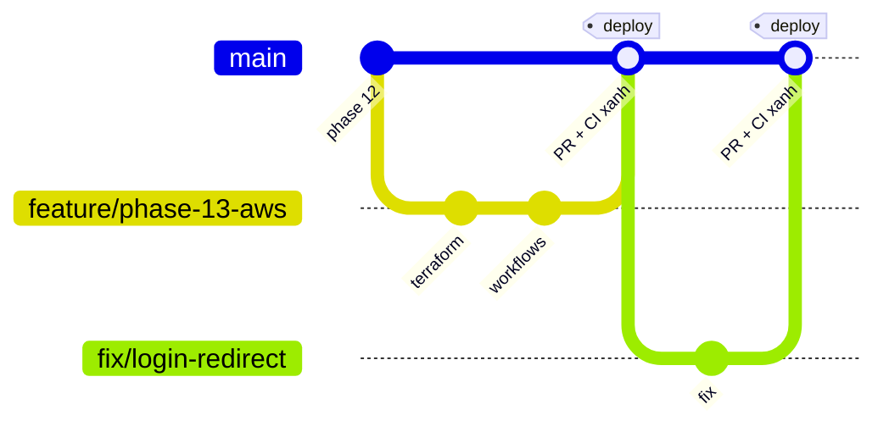
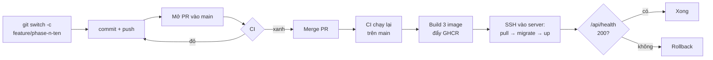

# GIT_FLOW.md — Quy trình nhánh và pipeline CI/CD

> Quyết định nền: [ADR-014](DECISIONS.md). Hạ tầng mà pipeline deploy tới:
> [AWS_PLAN.md](AWS_PLAN.md) · cách dựng: [infra/README.md](../infra/README.md).

---

## 1. Mô hình nhánh

Giữ nguyên quy ước ở CLAUDE.md §8: **không có `develop`, `release/*`, `hotfix/*`.** Một
người làm thì `main` vừa là nhánh tích hợp vừa là nhánh phát hành.

| Nhánh | Dùng cho | Sống bao lâu |
|---|---|---|
| `main` | Luôn chạy được. **Mỗi commit trên `main` là một bản production.** | Mãi mãi |
| `feature/phase-<n>-<tên>` | Một phase | Tới khi merge |
| `fix/<tên>` | Sửa lỗi ngoài phase | Vài giờ |

Điều thay đổi so với trước Phase 13: **không push thẳng lên `main` nữa.** Mọi thay đổi đi
qua Pull Request, vì PR là nơi CI chạy và là cửa duy nhất trước production.

## 2. Vòng đời một thay đổi

1. `git switch -c feature/phase-13-aws` từ `main` mới nhất.
2. Commit theo Conventional Commits (CLAUDE.md §8), push nhánh.
3. Mở PR vào `main`. Quality Gate G1 (build + lint + test) giờ do CI chạy tự động; G2–G5
   vẫn theo [QUALITY_GATES.md](QUALITY_GATES.md).
4. CI xanh và đã qua G5 → merge. Dùng **squash merge** để `main` có đúng một commit cho mỗi
   PR, tức mỗi bản deploy ứng với một commit — rollback chỉ cần chọn SHA.
5. Merge xong, workflow Deploy tự chạy. Không cần làm gì thêm.

## 3. Hai workflow

### `ci.yml` — chạy khi mở hoặc cập nhật PR vào `main`

| Job | Chạy gì | Bắt được |
|---|---|---|
| `backend` | lint, format, build, unit test, e2e trên Postgres 16 thật | Lỗi kiểu, test vỡ, migration hỏng |
| `frontend` | lint, format, test, `next build` | Lỗi kiểu, trang không build được |
| `infra` | `terraform fmt -check`, `terraform validate` | Lỗi cú pháp Terraform. **Không** chạm tới AWS |

### `deploy.yml` — chạy khi có commit mới trên `main`

| Job | Chạy gì |
|---|---|
| `ci` | Gọi lại nguyên `ci.yml`. Kết quả merge có thể khác kết quả trên nhánh |
| `images` | Build `backend`, `backend-migrate`, `frontend`; đẩy lên GHCR với tag `<sha>` và `latest` |
| `deploy` | Chép `infra/server/*` lên server → `docker compose pull` → `migrate` → `up -d` → gọi `/api/health` |

Job `deploy` chỉ chạy khi variable `DEPLOY_ENABLED` bằng `true`. Trước khi server tồn tại,
workflow dừng ở bước build image và vẫn xanh.

Migration chạy như **một bước riêng, một lần**, trước khi code mới nhận request — không chạy
lúc app khởi động. `concurrency: deploy-production` bảo đảm hai lượt deploy không chạy
migration cùng lúc.

## 4. Rollback

Image của mọi commit vẫn nằm trên GHCR, nên quay về bản cũ không cần build lại:

1. GitHub → Actions → **Deploy** → Run workflow.
2. Nhập SHA đầy đủ của commit muốn quay về vào `image_tag`.

Rollback **chỉ đổi code, không đảo migration.** Prisma không có "migrate down". Vì vậy
migration nên tương thích ngược với bản code liền trước: thêm cột nullable trước, xóa cột cũ
ở một bản deploy sau. Nếu migration đã phá dữ liệu, cách quay lại duy nhất là khôi phục
backup ([infra/README.md](../infra/README.md) §5).

Sau khi rollback, `main` vẫn chứa commit lỗi: phải `git revert` nó, nếu không lần merge kế
tiếp sẽ deploy lại đúng lỗi đó.

## 5. Cấu hình một lần trên GitHub

Settings → Environments → tạo environment **`production`**, đặt *Deployment branches* là
chỉ `main`, rồi thêm secret và variable **vào environment đó** (không đặt ở cấp repo).
`DEPLOY_SSH_KEY` tương đương quyền root trên server; đặt trong environment thì workflow
chạy từ nhánh khác không đọc được nó.

| Loại | Tên | Giá trị |
|---|---|---|
| Secret | `DEPLOY_SSH_KEY` | Khóa **bí mật** dành riêng cho GitHub Actions (không phải khóa cá nhân của bạn) |
| Secret | `DEPLOY_KNOWN_HOSTS` | Kết quả `ssh-keyscan -t ed25519 <static_ip>` |
| Variable | `DEPLOY_HOST` | Static IP từ `terraform output static_ip` |
| Variable | `APP_URL` | `https://<tên miền>`, không có `/` cuối |
| Variable | `DEPLOY_ENABLED` | `true` khi server đã sẵn sàng |

Settings → Branches → thêm rule cho `main`: **Require a pull request before merging** và
**Require status checks to pass**, chọn ba check `backend`, `frontend`, `infra`.

Không cần tạo token cho GHCR: workflow dùng `GITHUB_TOKEN` có sẵn, và truyền chính token đó
(hết hạn khi job kết thúc) cho server để kéo image.

## 6. Vì sao không dùng Argo CD

Argo CD là công cụ GitOps **cho Kubernetes**: nó chạy trong cluster, liên tục so trạng thái
cluster với manifest trong Git rồi tự đồng bộ. Không có Kubernetes thì không có gì để nó
quản lý. Chi phí tối thiểu để có Kubernetes (EKS khoảng 73 USD/tháng, hoặc máy khoảng 4 GB
cho k3s + Argo CD) lớn gấp nhiều lần toàn bộ hạ tầng hiện tại.

Pipeline ở trên giữ được ý chính của GitOps — Git là nguồn sự thật, không ai sửa tay trên
server — theo mô hình **đẩy** (CI đẩy thay đổi lên server) thay vì mô hình **kéo** của Argo.
